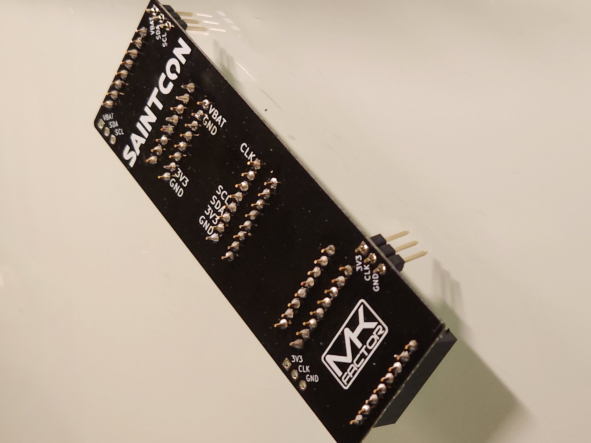
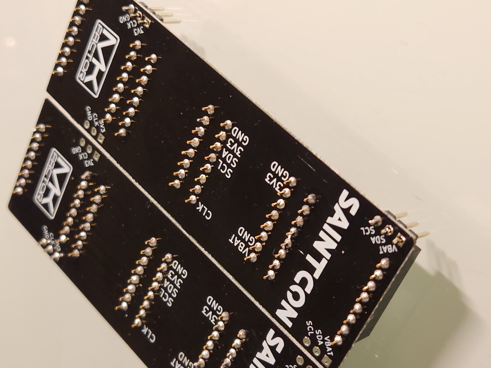
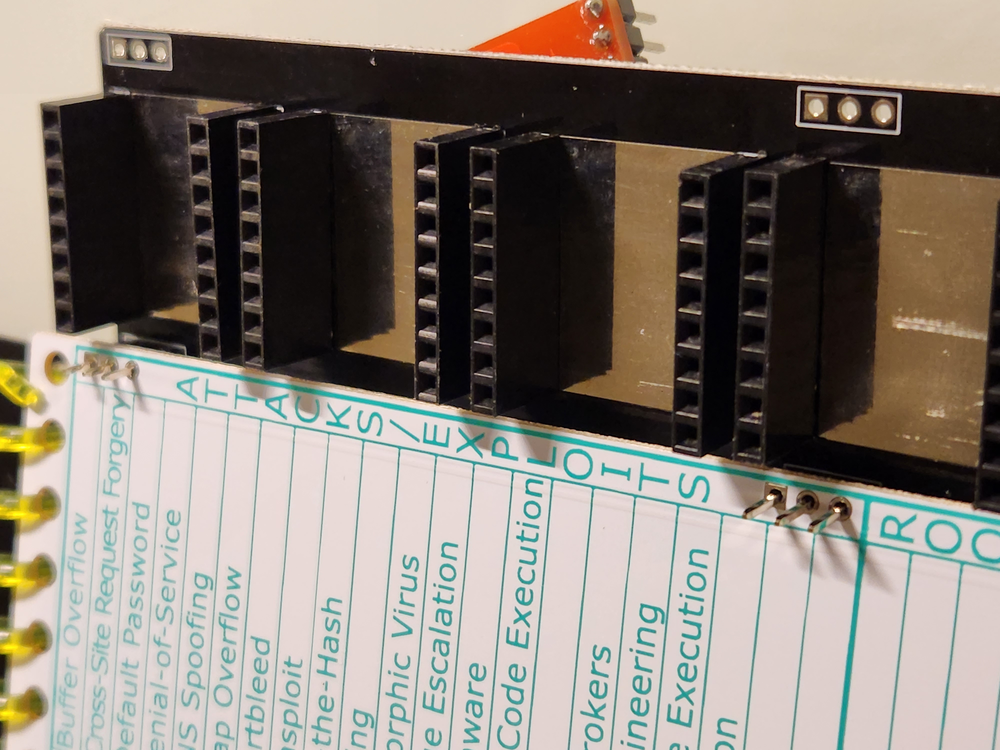
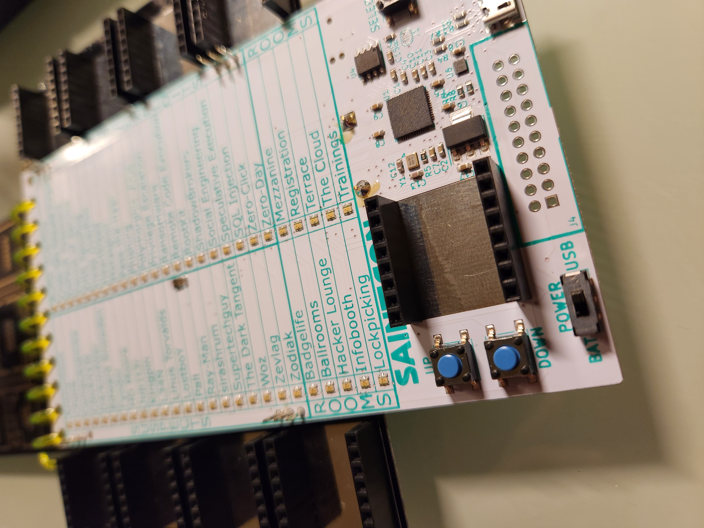

# Saintcon 2022 Badge

## Each badge comes with:

  * Two minibadge "wings" capable of holding 4 minibadges each.
        _they are panelized and will need to be seperated._
        __Waiting until they are both soldered before separating may prevent mistakes, but it isn't necessary.__

  * Four 3x1 pins

  * Eighteen 1x8 headers

## Wing Assembly Instructions

### The two wings need to be mirrors of each other!!

__If one wing has its two 3x1 headers on the right side then the other wing needs them on the left.__

_A tip for remembering is if your wings are still connected only solder the 3x1 on the four OUTER holes_

1. Solder all eight 1x8 headers on a wing.
    __The silver rectangle should be visible between the headers.__
    _This is easiest if you solder one pin on the header first then get it lined up before soldering the rest._

2. After all eight of the 1x8 headers are soldered on a wing flip it face down so the Saintcon logo is face up.
    Then place two 3x1 pins short end on top and __on the same side.__
    __There should only be two 3x1 pins per wing.__

    
    

3. Once those are in place again solder only one pin of the set while you make sure it is lined up correctly then solder the rest. _It is easier to fix any angling while only one of the 3x1 is soldered._

4. Repeat for the second wing.
    __Make sure the 3x1 are a mirror of the first one!__
    _I found it easiest to remember if both wings were side by side with the 3x1 pins on the outside holes._

    

5. Make sure your badge is off and at least one battery is removed. 

6. Once both wings are fully soldered then you can add them to the badge by soldering the 3x1 pins onto the badge.

   1. With the badge face up and open place a wing __under__ the badge.

   2. Lift up the wing until the pins are fully through the holes on the badge.
      
   
   3. Solder the pins.
      _Again, only solder one pin first so it is easier to fix misalignments before soldering the rest._

  

7. Solder the last minibadge headers on the minibadge slot on the badge.
  

8. Find clues and collect minibadges!
